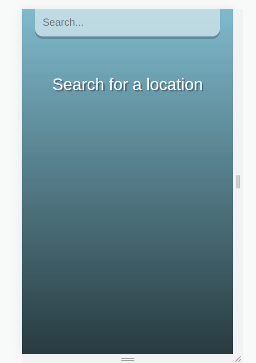
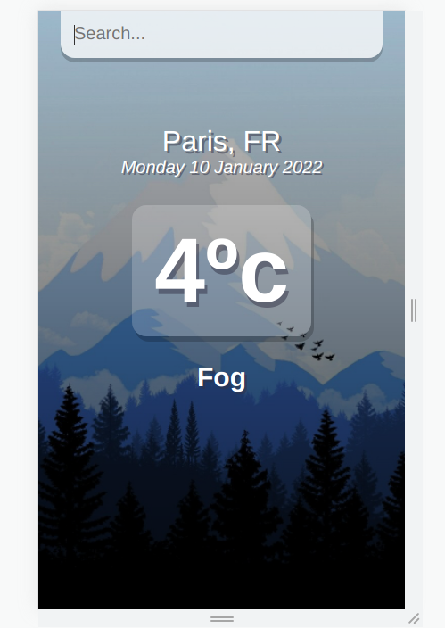
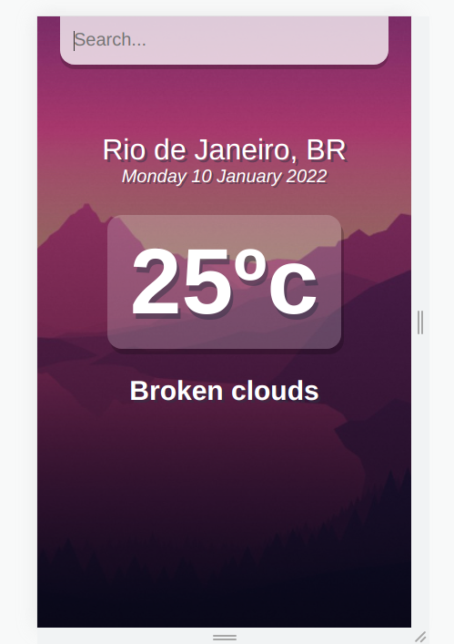
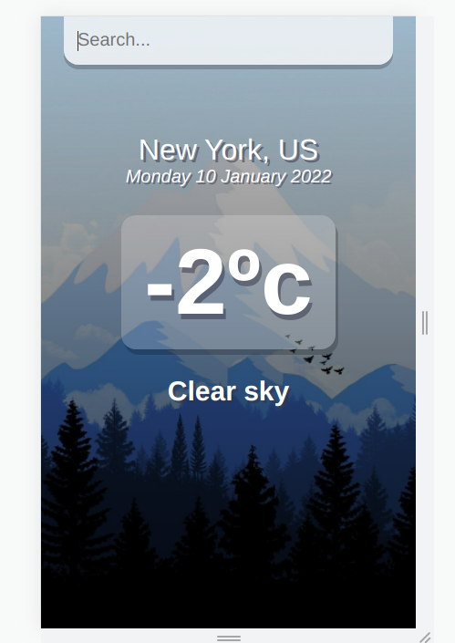
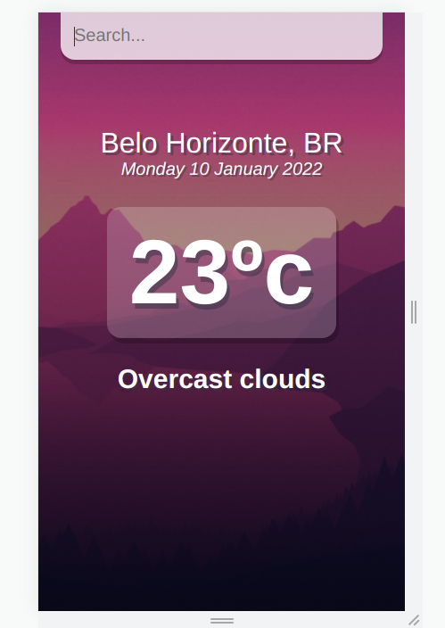

# Projeto-Weather

**Aplicação em React JS** 
Procure por qualquer cidade e receba informações sobre o clima em tempo real. 
A aplicação funciona alimentada por uma api(https://openweathermap.org/api) que fornece estas informações.

  
  
  
  
  

